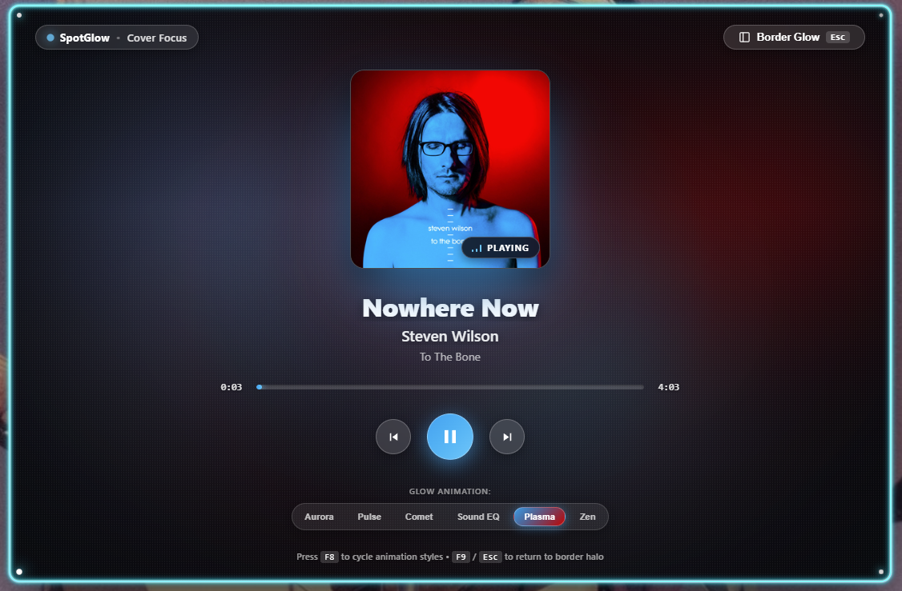

# SpotGlow

A Windows 10/11 app that draws an animated glow around the edge of the Spotify desktop window, colored and styled by the currently playing song.


](image.png)

**Hard constraint:** Windows SMTC (`GlobalSystemMediaTransportControlsSessionManager`) is the exclusive data source. No Spotify Web API, no OAuth, no dev account, no audio capture.

---

## ⚡ One-Command Installation

Any user on Windows 10/11 can install and launch SpotGlow with **a single command**:

### Method 1: PowerShell Web Installer (Recommended)
Open PowerShell and run:
```powershell
irm https://raw.githubusercontent.com/Saimun-jd/spotglow/main/install.ps1 | iex
```
*(Installs cleanly into `%LOCALAPPDATA%\Programs\SpotGlow`, creates Start Menu shortcuts, and launches instantly—no Administrator rights required!)*

### Method 2: Windows Package Manager (`winget`)
```cmd
winget install spotglow
```

### Method 3: Silent Installer Command
If you downloaded the setup executable or are deploying across machines:
```cmd
SpotGlow_0.1.0_x64-setup.exe /S
```

### Method 4: Portable Executable (Zero Install)
You can also run the standalone release executable `spotglow.exe` directly without any installation.

---

## Building the Installer Package

To build the standalone NSIS installer bundle yourself:
```powershell
npm run tauri build -- --bundles nsis
```
The installer is packaged at:
`src-tauri/target/release/bundle/nsis/SpotGlow_0.1.0_x64-setup.exe` (only ~1.88 MB!).

## Architecture & Repo Layout

```
├── src-tauri/
│   ├── src/
│   │   ├── main.rs           # Windows subsystem entrypoint
│   │   ├── lib.rs            # Tauri 2 app builder, tracing init, event bridging
│   │   ├── state.rs          # AppState (TrackMetadata, PlaybackStatus, TrackUpdatePayload)
│   │   ├── smtc.rs           # WinRT session manager, event listeners, thumbnail fetch
│   │   ├── palette.rs        # K-means clustering (k=5), HSL scoring, mood metrics
│   │   ├── window_tracker.rs # Spotify HWND tracker & WinEvent hooks
│   │   ├── overlay.rs        # Click-through overlay, Z-order & DWM bounds tracking
│   │   ├── settings.rs       # Settings persistence
│   │   └── tray.rs           # Tray menu & style preset switcher
│   └── Cargo.toml            # Rust dependencies & Windows API bindings
├── src/
│   ├── main.ts               # Frontend event listeners, mode switching & HUD
│   ├── glow.ts               # 6 creative animation preset renderers & canvas engine
│   └── styles.css            # Ambient CSS tokens, frosted shroud & responsive HUD
├── index.html                # Overlay markup & Cover Art Focus card
├── install.ps1               # One-command silent installer script
├── package.json              # Web dependencies & Tauri CLI scripts
└── PLAN.md                   # Comprehensive feature & phase implementation plan
```

---

## How to Run & Verify

### Running Unit Tests (Palette extraction & mood)
```powershell
cd src-tauri
cargo test palette -- --nocapture
```
Runs 5 automated unit tests covering:
- Vivid / neon palette extraction
- Dark / mellow palette extraction
- Pure monochrome / B&W handling
- Dual-tone complementary hue detection
- Performance benchmark (< 30 ms target; completes in ~26 ms)

### Phase 1 & 2 SMTC + Palette CLI Spike
Run the standalone CLI spike in your terminal:
```powershell
cd src-tauri
cargo run --example smtc_spike
```
1. Play, pause, or switch songs in Spotify.
2. Observe real-time console updates:
   ```text
   >>> [TRACK UPDATE] "Road Back Home" by "Zakk Wylde" [Paused] | Mood: Mellow
       Palette -> Primary: #904d38 | Secondary: #d5884e | Accent: #d5884e
       Avg Sat: 0.17 | Avg Brightness: 0.15
   ```
3. Extracted album art is saved to `%APPDATA%\SpotGlow\current_thumbnail.png` and `.\current_thumbnail.png`.

### Running the Full Tauri Application
```powershell
npm run tauri dev
```
Launches the transparent overlay window and listens for `"track_update"` events via the Tauri IPC bridge.
